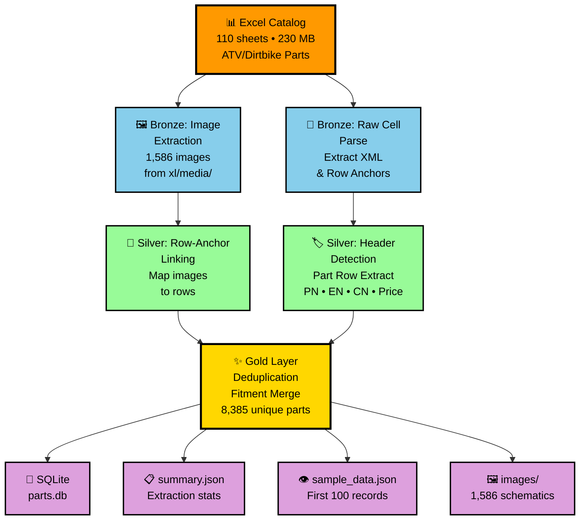

# InventoryFlow Parts Catalog Extractor

Data extraction pipeline that transforms a 230 MB Excel-based ATV / pitbike / dirtbike parts catalog into a structured SQLite database with extracted schematic images.

## Tech Stack

- Python 3.8+ (`openpyxl`, `pillow`)
- SQLite (output database)
- Standard library: `zipfile`, `xml.etree`, `sqlite3`, `json`, `re`

## Architecture



## Data Pipeline

| Stage | Layer | What it does |
|-------|-------|--------------|
| 1 | **Bronze** | Extract 1,586 embedded images from `xl/media/`; parse drawing XML for row anchors |
| 2 | **Silver** | Walk 110 sheets, detect dynamic headers, extract part rows (PN, EN name, CN name, price) |
| 3 | **Gold** | Deduplicate parts across sheets, merge fitments into JSON arrays, write SQLite + summaries |

## Outputs

| File | Description |
|------|-------------|
| `parts.db` | SQLite database — 8,385 unique parts |
| `images/` | 1,586 extracted schematic images |
| `summary.json` | Totals + per-sheet extraction counts |
| `sample_data.json` | First 100 records (human-readable) |

## Database Schema

```sql
CREATE TABLE parts (
    part_number  TEXT PRIMARY KEY,  -- manufacturer part number
    english_name TEXT,               -- e.g. "front brake assy"
    chinese_name TEXT,               -- e.g. "前碟刹总成"
    price        DECIMAL,            -- retail USD
    image_path   TEXT,               -- e.g. "images/image142.png"
    fitment      TEXT                -- JSON array of {year, make, model, sheet}
);
```

**Sample fitment JSON:**
```json
[
  { "year": "2016-2020", "make": null, "model": "PREDATOR 125", "sheet": "PREDATOR 125 (2016-2020)" },
  { "year": "2021+", "make": null, "model": "Bull125 AU125-2", "sheet": "Bull125 AU125-2 (2021+)" }
]
```

## Quick Start

```bash
# 1. Place InventoryFlow_Data.xlsx in project root

# 2. Install dependencies
pip install openpyxl pillow

# 3. Run pipeline
python extract.py

# 4. Query output
sqlite3 parts.db
```

## Repository Structure

```
inventoryflow/
├── extract.py              # Main extraction pipeline
├── parts.db                # SQLite database (generated)
├── summary.json            # Aggregate stats (generated)
├── sample_data.json        # First 100 records (generated)
├── images/                 # Extracted schematic images (generated)
├── ARCHITECTURE_README.md  # Detailed technical docs
├── README.md               # This file
├── .gitignore              # Excludes source XLSX and large binaries
└── promt.txt               # Original project requirements
```

> **Note:** `InventoryFlow_Data.xlsx` (~230 MB) is excluded from version control via `.gitignore`.

## Data Quality

| Metric | Value |
|--------|-------|
| Unique parts | 8,385 |
| Parts with images | ~655 (7.8%) |
| Catalog sheets | 96 |
| Reference sheets skipped | 14 (battery, spark plugs, manuals, etc.) |
| Cross-sheet deduplication | Yes — fitments merged into JSON array |

## Known Limitations

1. **Image linkage:** ~655 parts have linked images. Remaining images are in `images/` but not mapped due to Excel layout variations.
2. **Make/brand:** Not present in source workbook. Can be added downstream via sheet-name lookup.
3. **Reference sheets:** Intentionally skipped as they don't fit the part-row schema.

## Extending

| Use Case | Approach |
|----------|----------|
| Add brand/make | Sheet-name → brand lookup in `derive_fitment()` |
| Improve image linking | Per-sheet geometry-based matching |
| Ingest reference sheets | Separate tables (batteries, spark plugs, etc.) |
| Scheduled refresh | Cron / Airflow DAG wrapping `extract.py` |
| API layer | FastAPI/Flask over `parts.db` |
| Analytics | Load into Pandas / dbt / warehouse for dashboards |

## License

Extraction logic is open for reuse. Source catalog data belongs to the respective rights holder.
