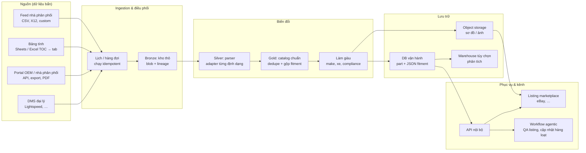
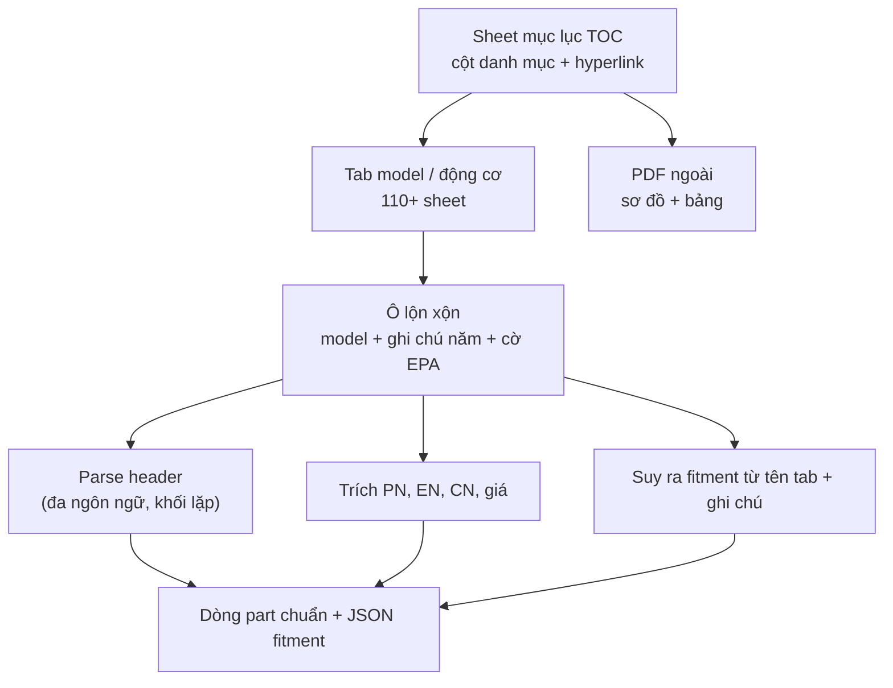
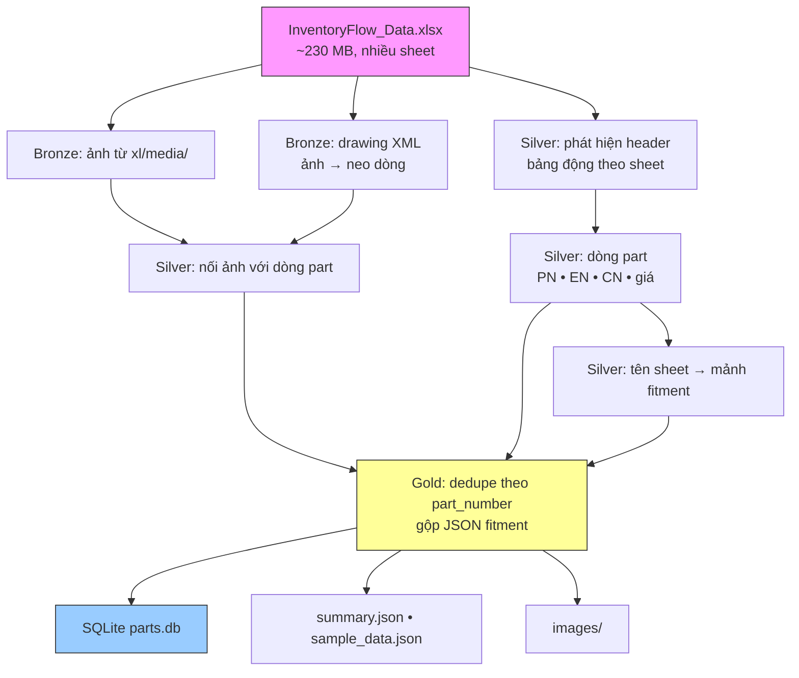

# Bối cảnh dữ liệu & kiến trúc POC — bản tiếng Việt (đọc nhanh)

Tài liệu này gộp **hai bản tiếng Anh**: [`DATA_CONTEXT.md`](./DATA_CONTEXT.md) (bối cảnh startup / luồng dữ liệu) và [`ARCHITECTURE_README.md`](../ARCHITECTURE_README.md) (chi tiết pipeline `extract.py`). Mục đích: **data engineer** đọc nhanh bản VI, rồi chuyển sang bản EN khi cần chi tiết hoặc trích dẫn cho team quốc tế.

---

# Phần A — Bối cảnh dữ liệu (tương đương `DATA_CONTEXT.md`)

## A.1. Bối cảnh kinh doanh

**InventoryFlow** phục vụ **đại lý powersports** (PG&A, phụ tùng OEM và aftermarket) muốn **bán đa kênh ở quy mô marketplace** (ví dụ eBay) mà không cần xây hẳn một team e-commerce nội bộ. Thông điệp sản phẩm công khai thường nhấn mạnh:

- **Đồng bộ tồn kho DMS** tự động (site có nhắc Lightspeed).
- **Tạo listing** với **ảnh, fitment, mô tả** lấy từ catalog.
- **Giá tuân MAP**, nhãn vận chuyển, vận hành đa kênh.

Người sáng lập / vận hành trong ngành thường tham gia cộng đồng LinkedIn lớn (OEM/dealer powersports) — go-to-market **nhiều quan hệ** và **nặng catalog**: thành công phụ thuộc việc biến **dữ liệu OEM/nhà phân phối lộn xộn** thành **listing đủ tin để mua** với số lượng lớn.

Tham chiếu sản phẩm: [inventoryflow.ai](https://inventoryflow.ai/).

---

## A.2. Vấn đề dữ liệu cốt lõi

### Triệu chứng (“messy ingestion”)

| Triệu chứng | Vì sao đau |
|-------------|------------|
| **Định dạng không thống nhất** | Cùng một catalog có thể là Excel, Google Sheets, PDF sơ đồ, export portal, hay payload API — tên cột và ngôn ngữ khác nhau. |
| **Điều hướng bằng hyperlink / sheet** | Sheet “mục lục” trỏ sang tab khác hoặc file ngoài; **phụ tùng thật** nằm sau nhiều bước (giống workbook nhiều tab + PDF ngoài). |
| **Bố cục không ổn định** | Header lặp lại trong một sheet; sơ đồ nổi phía trên bảng; bảng part reset theo từng ảnh phóng to. |
| **Nhiều ngữ nghĩa trong một ô** | Mã model, tên marketing, cắt năm, ghi chú kiểu `*2021 and newer`, `EPA` — tất cả trong một chuỗi. |
| **Trùng part trên nhiều fitment** | Một SKU xuất hiện trên nhiều sheet model; fitment phải **gộp**, không nhân bản theo từng kênh. |
| **Khóa nối ảnh yếu / thiếu** | Ảnh neo theo dòng hoặc vùng, không phải lúc nào cũng neo đúng dòng có part number ổn định. |

### “Chuẩn tốt” cho listing downstream

Hệ thống phía sau cần **catalog đã chuẩn hóa**:

- **Part number** ổn định làm khóa nghiệp vụ chính.
- **Mô tả** tiếng Anh (và nếu cần **tiếng Trung** hoặc khác).
- **Giá** và trường chính sách phục vụ MAP / rule marketplace.
- **Ảnh sơ đồ / sản phẩm** trong object storage bền (ví dụ **R2** khi thiết kế production đầy đủ), catalog chỉ cần tham chiếu URL/key.
- **Fitment** dạng có cấu trúc: JSON mô tả **năm / hãng (make) / model** (kèm nguồn gốc: sheet hoặc file gốc).

POC trong repo này hiện thực hóa dạng quan hệ + JSON fitment ở quy mô **SQLite**; production sẽ mở rộng lưu trữ và điều phối quanh cùng các khái niệm.

---

## A.3. Kiến trúc giải pháp: các lớp khái niệm

Mô hình thực dụng kiểu **medallion**, áp dụng cho tài liệu và bảng tính:

| Lớp | Vai trò | Nội dung điển hình |
|-----|---------|---------------------|
| **Bronze** | **Land & preserve** | File thô, response API thô, media đã trích, parse tối thiểu (ví dụ unzip XLSX, dump `xl/media/`, parse drawing XML). |
| **Silver** | **Structure & link** | Bảng part, phát hiện header, neo ảnh theo dòng, cột theo locale, kiểu theo từng nguồn. |
| **Gold** | **Canonical catalog** | Part đã khử trùng lặp, fitment đã gộp, part number đã kiểm tra, làm giàu (make/brand, cờ EPA), xuất ra **DB + object storage**. |
| **Serving** | **Channels** | Builder listing, sync DMS, index tìm kiếm, workflow “agentic” gợi ý nội dung listing từ mô hình gold. |

---

## A.4. Sơ đồ: luồng dữ liệu end-to-end (quy mô công ty)

Sơ đồ mang tính **hướng tới nền tảng đầy đủ**: nhiều nguồn → một catalog chuẩn → marketplace và công cụ nội bộ.



---

## A.5. Sơ đồ: hỗn loạn kiểu spreadsheet → dòng có cấu trúc

Phản ánh workbook có **mục lục**: cột phân loại xe; ô chứa link; ghi chú mã hóa cắt năm.



---

## A.6. Sơ đồ: pipeline POC của repo này

Repo triển khai extractor **gốc Excel** (`extract.py`): **Bronze** (media + neo), **Silver** (dòng part theo sheet), **Gold** (dedupe + gộp fitment) → **SQLite** + thư mục `images/` cục bộ. Luồng logic tương tự có thể tái sử dụng cho **Google Sheets** (export XLSX hoặc API → bước silver/gold giống) hoặc **PDF** (parser Bronze/Silver khác; schema Gold giữ ổn định).



---

## A.7. Ánh xạ output POC → khái niệm production

| Artifact POC | Tương đương production |
|--------------|----------------------|
| Bảng `parts` với cột `fitment` JSON | Cùng schema logic; có thể chuyển Postgres + JSONB hoặc document store. |
| `images/` trên đĩa | Key **R2** (hoặc S3) + URL CDN; blob content-addressed để khử trùng lặp. |
| Chạy batch một file | **Job theo lịch**, cấu hình theo tenant, **data contract** theo từng nhà cung cấp. |
| SQLite | **DB được quản lý** + migration; **warehouse** tùy chọn cho analytics. |

---

## A.8. Góc nhìn tuyển dụng / kỹ thuật

Mô tả công khai cho tầng dữ liệu thường nhấn **TypeScript**, **ETL**, **messy ingestion**, **ship thực dụng** — trong khi POC này là **Python** để xử lý file nhanh. Chia tách đó là **bình thường**: Bronze/Silver thường dùng công cụ nhanh nhất cho từng định dạng (Python, serverless, hoặc parser TS), còn Gold và API hội tụ về stack sản phẩm hằng ngày. Thứ **bền** là **schema chuẩn** (định danh part, thuộc tính, fitment, con trỏ media), không phải ngôn ngữ của extractor đầu tiên.

Bản ước lượng cấu trúc TypeScript (không có TS trong repo POC): [`TYPESCRIPT_ESTIMATE.md`](./TYPESCRIPT_ESTIMATE.md).

---

## A.9. Tham chiếu (EN + link)

- [DATA_CONTEXT.md](./DATA_CONTEXT.md) — bản EN đầy đủ.
- [TYPESCRIPT_ESTIMATE.md](./TYPESCRIPT_ESTIMATE.md) — repo POC **không có TS**; ước lượng layout TS cho team product.
- Sản phẩm: [https://inventoryflow.ai/](https://inventoryflow.ai/)
- Đăng nhập app đại lý: [https://app.inventoryflow.ai/handler/sign-in](https://app.inventoryflow.ai/handler/sign-in)
- Repo: `README.md`, `ARCHITECTURE_README.md`, `extract.py`

---

# Phần B — Kiến trúc POC & pipeline (tương đương `ARCHITECTURE_README.md`)

## B.1. Mục tiêu dự án

Dự án nhận **một file Excel lớn** (`InventoryFlow_Data.xlsx`, ~230 MB) chứa catalog phụ tùng ATV / pitbike / dirtbike và biến thành bộ file **sạch**, dễ dùng trong code hoặc mở tay:

- Cơ sở dữ liệu **SQLite** (`parts.db`) — **một dòng cho mỗi part number duy nhất**.
- Thư mục **mọi ảnh nhúng** trong workbook (`images/`).
- Hai file JSON dễ đọc (`summary.json`, `sample_data.json`).

Mục tiêu đơn giản: đưa vào file Excel, nhận lại dữ liệu tidy để xây website, app, hoặc công cụ đại lý — **không cần mở lại spreadsheet**.

---

## B.2. Script làm gì — từng bước

Toàn bộ logic nằm trong **một file Python**: `extract.py`. Khi chạy, script làm **ba việc theo thứ tự**:

### Giai đoạn 1 — Trích ảnh và xác định vị trí từng ảnh

File `.xlsx` thực chất là **file ZIP**. Bên trong, mọi ảnh dán vào workbook nằm trong `xl/media/` dưới dạng `.png` hoặc `.jpg`.

1. Script mở workbook như ZIP và copy mọi file ảnh vào thư mục `images/`.
2. Excel lưu file “drawing” riêng ghi **ảnh neo vào ô / dòng nào**. Script đọc drawing và dựng lookup kiểu: “trong sheet X, ảnh `image1234.png` neo ở dòng 47.”

Lookup này là cơ sở để sau đó **nối ảnh với part**.

### Giai đoạn 2 — Đọc từng sheet catalog và trích dòng part

Workbook có **110 sheet**. Hầu hết là catalog phụ tùng cho **một model** ATV/xe cụ thể (ví dụ `Bull125 AU125-2 (2021+)` hoặc `KMB60 Engine`). Một số là bảng tham chiếu (pin bugi, sách hướng dẫn, …) — **không** theo schema “một dòng = một part” — script **bỏ qua**.

Với mỗi sheet catalog phụ tùng, script:

1. **Duyệt dòng** tìm hàng header. Catalog thường có header kiểu `No. | Part Number | EN name | CN name | … | Retail`; nhiều sheet **lặp header nhiều lần** vì mỗi sơ đồ (khung, phanh, đầu động cơ, …) là một bảng nhỏ trong cùng sheet. Script nhận diện vài kiểu header (Anh, Trung, “U8 Code”, “NEW PART NUMBER”, “Parts No.”, …) và chọn cột part number tốt nhất khi có nhiều cột.
2. Sau khi có header, mỗi dòng tiếp theo được đọc như một part: **part number**, **tên tiếng Anh**, **tên tiếng Trung**, **giá retail**.
3. **Tên sheet** chính là **fitment** — cho biết part khớp model nào. Nếu tên sheet có khoảng năm (`(2018-2020)`, `(2021+)`, `(2024)`, …) script cũng trích ra.
4. Nếu ảnh trong sheet **neo cùng dòng** với part, đường dẫn ảnh gắn vào part qua `image_path`.
5. Part xuất hiện trên **nhiều sheet** (ví dụ bu lông khớp mười model) chỉ lưu **một lần**, mọi fitment model gom vào **một mảng JSON**.

### Giai đoạn 3 — Ghi output

Khi chạy xong:

- `parts.db` được tạo mới với các dòng part.
- `summary.json` ghi số tổng quan và số part theo từng sheet.
- `sample_data.json` ghi **100 part đầu** dạng pretty-print để người không kỹ thuật mở Notepad vẫn đọc được.

---

## B.3. Schema cơ sở dữ liệu

Một file SQLite (`parts.db`), một bảng:

```sql
CREATE TABLE parts (
    part_number  TEXT PRIMARY KEY,   -- mã part nhà sản xuất, duy nhất
    english_name TEXT,             -- mô tả tiếng Anh (vd: "front brake assy")
    chinese_name TEXT,             -- mô tả tiếng Trung (vd: "前碟刹总成")
    price        DECIMAL,          -- giá retail USD (cột "Retail")
    image_path   TEXT,             -- đường dẫn ảnh, vd: "images/image142.png"
    fitment      TEXT              -- mảng JSON — xem dưới
);
```

| Cột | Ý nghĩa |
|-----|---------|
| `part_number` | Mã part duy nhất — primary key. |
| `english_name` | Tên part tiếng Anh như trong workbook. |
| `chinese_name` | Tên tiếng Trung; trống nếu sheet không có cột Trung. |
| `price` | Giá retail (cột Retail); trống nếu không có. |
| `image_path` | Đường dẫn tương đối tới ảnh; trống nếu không có ảnh neo đúng dòng part. |
| `fitment` | Danh sách JSON các bản ghi `{year, make, model, sheet}` — mọi model part đó khớp. |

### Ví dụ JSON `fitment`

Cột `fitment` là mảng JSON vì cùng một part thường khớp nhiều model. Ví dụ (tay nắm):

```json
[
  { "year": null,        "make": null, "model": "FOXStorm 70 AY70-2",      "sheet": "FOXStorm 70 AY70-2" },
  { "year": "2016-2020", "make": null, "model": "PREDATOR 125",            "sheet": "PREDATOR 125 (2016-2020)" },
  { "year": null,        "make": null, "model": "Storm150 A150",           "sheet": "Storm150 A150" },
  { "year": "2021+",     "make": null, "model": "Bull125 AU125-2",         "sheet": "Bull125 AU125-2 (2021+)" }
]
```

Bốn trường mỗi phần tử:

- **year** — khoảng năm trích từ tên sheet nếu có (`"2016-2020"`, `"2021+"`, `"2024"`). `null` nếu tên sheet không có năm.
- **make** — trong workbook mẫu **luôn `null`**: không có cột hãng; tên sheet dùng mã model. Có thể bổ sung sau bằng bảng lookup nhỏ.
- **model** — tên model từ sheet, đã tách phần năm để gọn (ví dụ `"PREDATOR 125 (2016-2020)"` → `"PREDATOR 125"`).
- **sheet** — tên sheet gốc, giữ nguyên để **trace** về nguồn.

---

## B.4. Cấu trúc thư mục sau khi chạy

```
inventoryflow-poc/
├── InventoryFlow_Data.xlsx   (file nguồn — không sửa)
├── extract.py
├── parts.db                  (SQLite — ví dụ ~8.385 part)
├── summary.json
├── sample_data.json
├── images/                   (ví dụ ~1.586 file ảnh)
├── docs/
│   └── DATA_AND_ARCHITECTURE_VI.md   (tài liệu này)
└── ARCHITECTURE_README.md    (bản EN chi tiết)
```

### `summary.json`

Số liệu tổng và danh sách từng sheet + số part trích được — tiện **sanity check**.

### `sample_data.json`

100 bản ghi đầu, pretty-print — xem nhanh cấu trúc một part.

---

## B.5. Thư viện Python (và lý do)

| Gói | Vì sao dùng |
|-----|-------------|
| `openpyxl` | Đọc workbook **từng ô**. Chọn thay vì `pandas` vì file ~230 MB và **header nhảy** — cần kiểm soát theo dòng. |
| `pillow` | Đi kèm openpyxl; tránh cảnh báo khi openpyxl gặp ô ảnh. (Không xử lý ảnh nâng cao, chỉ copy.) |
| Thư viện chuẩn | `zipfile`, `xml.etree`, `sqlite3`, `json`, `re` — không cần thêm gói cho phần lõi. |

---

## B.6. Chạy lại script

1. Đặt `InventoryFlow_Data.xlsx` ở thư mục gốc project (đúng tên).
2. Cài một lần:

   ```
   py -m pip install openpyxl pillow
   ```

3. Chạy:

   ```
   py extract.py
   ```

   Thường **1–2 phút** trên laptop thông thường. Chạy lại sẽ **ghi đè** `parts.db`, `images/`, `summary.json`, `sample_data.json` — **file Excel gốc không bị sửa**.

Nếu thay file Excel bằng bản mới cùng phong cách sheet, chỉ cần chạy lại script để build lại toàn bộ.

---

## B.7. Hướng mở rộng / việc nên làm tiếp

- **Cột make** — workbook không có hãng/brand rõ ràng. Cách sạch: lookup `tên sheet → brand` khi build `fitment`.
- **Nối ảnh–part** — khoảng **655 / 8.385** part có ảnh gắn; phần còn lại của ~1.586 ảnh nằm trong `images/` nhưng chưa map được part. Neo theo dòng; một số sheet để **tất cả ảnh phía trên** bảng part nên script không biết ảnh nào thuộc part nào — cải thiện cần xem layout từng sheet cụ thể.
- **Sheet tham chiếu** (pin, bugi, sách hướng dẫn, carb jet, …) **cố ý bỏ** vì không khớp dạng “một dòng = một part”. Nếu cần sau này — mỗi loại một **bảng riêng**.

---

*Bản VI này cố gắng bám sát nội dung hai file EN; nếu có lệch phiên bản, ưu tiên [`DATA_CONTEXT.md`](./DATA_CONTEXT.md) và [`ARCHITECTURE_README.md`](../ARCHITECTURE_README.md).*
