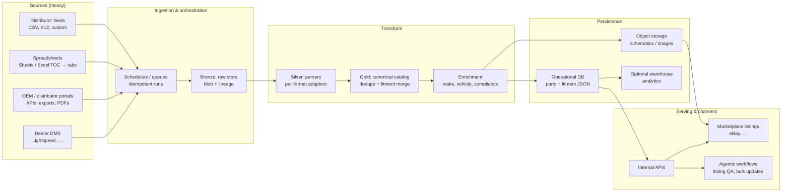
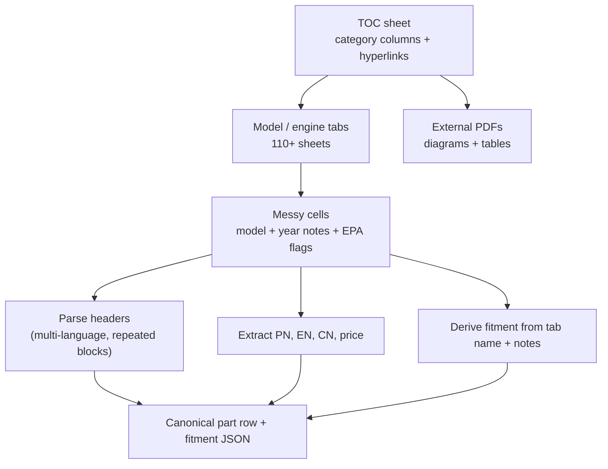
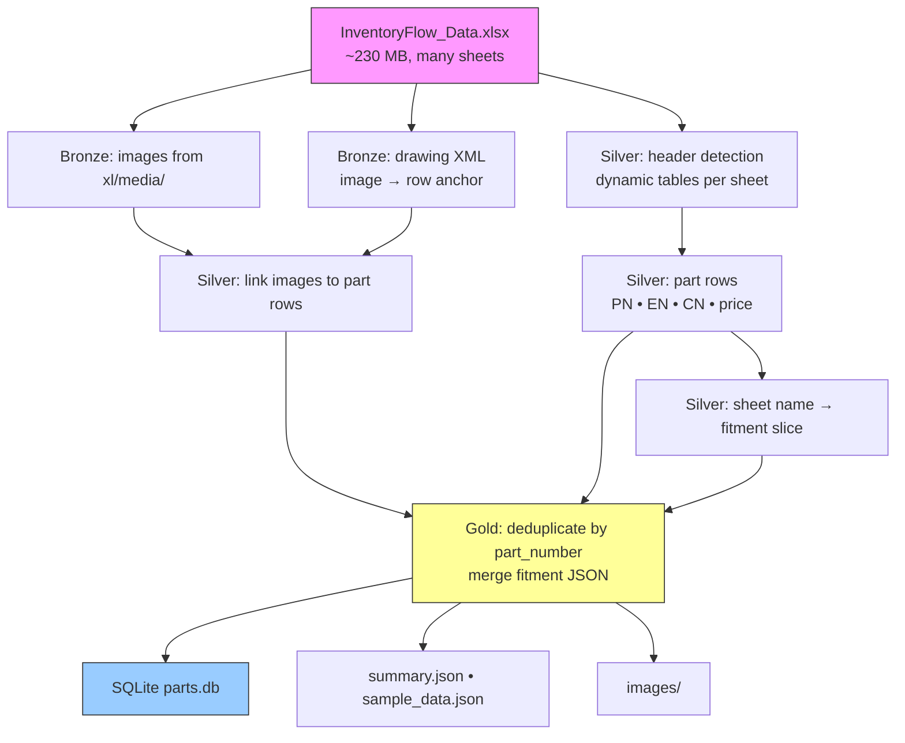

# Data context: problem, layers, and flow

This note frames **why** InventoryFlow needs a strong data layer, **what** breaks in the wild, and **how** this repository’s proof-of-concept (POC) fits into a broader ingestion story. Product positioning and public claims are summarized from [InventoryFlow](https://inventoryflow.ai/).

---

## 1. Business context

**InventoryFlow** targets **powersports dealerships** (PG&A, OEM and aftermarket parts) that want **marketplace-scale e-commerce** (e.g. eBay) without hiring a full e-commerce team. The product narrative emphasizes:

- Automated **DMS inventory sync** (e.g. Lightspeed mentioned on the site).
- **Listing creation** with catalog-sourced **images, fitment, and descriptions**.
- **MAP-aware pricing**, shipping labels, and multi-channel operations.

Founders and operators in this space often participate in large LinkedIn communities (e.g. powersports OEM/dealer networks), which matches a go-to-market that is **relationship-heavy** and **catalog-heavy**: success depends on turning **messy supplier and OEM data** into **buyer-trustworthy listings** at volume.

---

## 2. The core data problem

### 2.1 Symptoms (“messy ingestion”)

| Symptom | Why it hurts |
|--------|----------------|
| **Inconsistent formats** | Same catalog arrives as Excel, Google Sheets, PDF schematics, portal exports, or API payloads with different column names and languages. |
| **Hyperlink- and sheet-driven navigation** | A “table of contents” sheet links to other tabs or files; the *real* parts live several hops away (similar to multi-tab workbooks and external PDFs). |
| **Unstable layout** | Headers repeat inside a sheet; diagrams float above tables; part tables restart for each blow-up image. |
| **Mixed semantics in one cell** | Model codes, marketing names, year cutovers, and notes like `*2021 and newer` or `EPA` sit in one string. |
| **Duplicate parts across fitments** | One SKU appears on many model sheets; fitment must be **merged**, not duplicated per channel. |
| **Weak or missing join keys** | Images anchor to rows or regions, not always to a stable part-number row. |

### 2.2 What “good” looks like for listings

Downstream systems need a **normalized catalog** that can drive listings and compliance:

- Stable **part number** as primary business key.
- **English** (and where required **Chinese** or other) **descriptions**.
- **Price** and policy fields as needed for MAP and marketplace rules.
- **Schematic or product imagery** stored in durable object storage (e.g. **R2** in a full production design), addressable from the catalog.
- **Fitment** as structured data: JSON describing **year / make / model** (and provenance back to source sheets or files).

This POC implements the relational shape and fitment JSON at **SQLite** scale; production would extend storage and orchestration around the same concepts.

---

## 3. Solution architecture: conceptual layers

A practical pattern is **medallion-style** stages, adapted for documents and spreadsheets:

| Layer | Role | Typical contents |
|-------|------|------------------|
| **Bronze** | **Land & preserve** | Raw files, raw API responses, extracted media, minimal parsing (e.g. unzip XLSX, dump `xl/media/`, parse drawing XML). |
| **Silver** | **Structure & link** | Tables of parts, header detection, row-to-image anchors, locale-specific columns, per-source typing. |
| **Gold** | **Canonical catalog** | Deduplicated parts, merged fitments, validated part numbers, enrichment (make/brand, EPA flags), export to **DB + object storage**. |
| **Serving** | **Channels** | Listing builders, DMS sync, search indexes, and “agentic” workflows that propose listing copy from the gold model. |

---

## 4. Visual: end-to-end data flow (company scale)

The diagram below is **aspirational** for a full platform: multiple sources feeding one normalized catalog, then marketplaces and internal tools.

---

## 5. Visual: spreadsheet-style chaos → structured rows

This mirrors **table-of-contents** workbooks: columns segment vehicle categories; cells link to other sheets or files; notes encode year splits.

---

## 6. Visual: this repository’s POC pipeline

This repo implements an **Excel-native** extractor (`extract.py`): **Bronze** (media + anchors), **Silver** (per-sheet part rows), **Gold** (dedupe + fitment merge) → **SQLite** + local `images/`. It is the same logical flow you would reuse for **Google Sheets** (export to XLSX or API → same silver/gold steps) or **PDF** (Bronze/Silver parsers differ; Gold schema stays stable).

---

## 7. Mapping POC outputs to production concepts

| POC artifact | Production analogue |
|--------------|---------------------|
| `parts` table with `fitment` JSON | Same logical schema; may move to Postgres + JSONB or document store. |
| `images/` on disk | **R2** (or S3) keys + CDN URLs; content-addressed blobs for deduplication. |
| Single-file batch run | **Scheduled jobs**, per-tenant configs, and **data contracts** per supplier. |
| SQLite | **Managed DB** + migrations; optional **warehouse** for analytics. |

---

## 8. Hiring / engineering lens

Public role descriptions for the data layer emphasize **TypeScript**, **ETL**, **messy ingestion**, and **pragmatic shipping**—while this POC is **Python** for fast file wrangling. That split is normal: **Bronze/Silver** often uses the fastest tool for the format (Python, serverless, or parsers in TS), while **Gold and APIs** converge on the stack the product uses day to day. The durable artifact is the **canonical schema** (part identity, attributes, fitment, media pointers), not the language of the first extractor.

---

## 9. References

- [DATA_AND_ARCHITECTURE_VI.md](./DATA_AND_ARCHITECTURE_VI.md) — **Vietnamese** quick-read: this data context + `ARCHITECTURE_README.md` in one file.
- [TYPESCRIPT_ESTIMATE.md](./TYPESCRIPT_ESTIMATE.md) — **no TS in this POC repo**; estimated TypeScript layout and boundaries for a TS-first product team (onboarding).
- Product: [https://inventoryflow.ai/](https://inventoryflow.ai/)
- Dealer app sign-in (product surface): [https://app.inventoryflow.ai/handler/sign-in](https://app.inventoryflow.ai/handler/sign-in)
- Repo entry points: root `README.md`, `ARCHITECTURE_README.md`, `extract.py`
