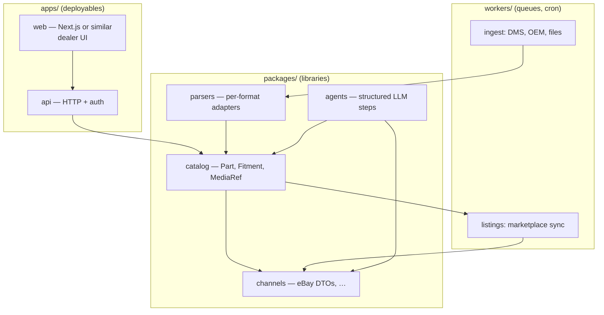
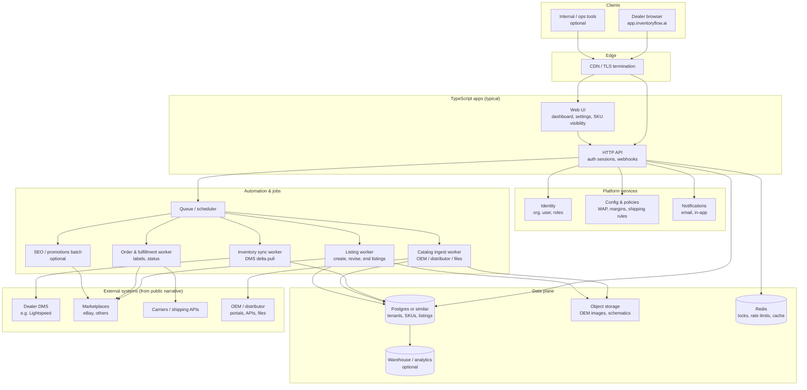
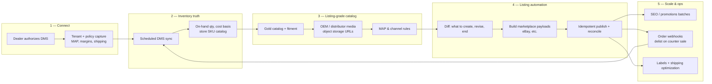
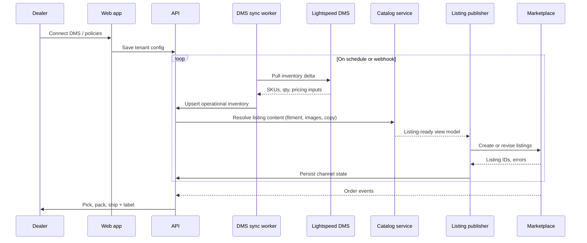

# TypeScript usage and structure (estimate for InventoryFlow)

This document is for **onboarding orientation**: it connects the [data context](./DATA_CONTEXT.md) to **where TypeScript usually lives** in a startup like InventoryFlow, and sets expectations about **this repository** versus **their private product code**.

---

## 1. What this POC repo actually contains

| Item | Reality |
|------|--------|
| **TypeScript / JavaScript** | **None** in `inventoryflow-poc`. There is no `package.json`, no `src/**/*.ts`, and no build pipeline. |
| **Ingestion implementation** | **Python** (`extract.py`): Excel unzip, drawing anchors, sheet walking, SQLite output. |
| **Why that matters** | Public job posts often say **“TypeScript across the stack”** for the **product** team. A take-home or spike can still be **Python** (or any fast tool) if the interview artifact is “prove you can normalize messy catalog data.” |

So: **there are no hidden TypeScript scripts “behind” this repo.** Anything below is an **educated estimate** of how a TS-heavy company **might** structure code you will not see until you have repo access.

---

## 2. What public signals imply about the stack

From InventoryFlow’s public hiring copy (summarized earlier in this project):

- **TypeScript** is the default implementation language for shipping product.
- Work spans **ETL / messy ingestion**, **DMS** (e.g. Lightspeed), **marketplaces** (eBay, etc.), and **“agentic”** automation around listings.

That combination usually implies **more than one deployable** (not one giant script):

- **Web app** (dealer-facing UI; sign-in lives under `app.inventoryflow.ai`).
- **API / workers** (sync, ingestion jobs, marketplace publishers).
- **Shared libraries** (types for catalog, fitment JSON, listing payloads).

Exact names and folder layout are unknown without their monorepo.

---

## 3. Estimated shape: packages and boundaries

A pragmatic TS layout often mirrors the **Bronze → Silver → Gold → Serving** layers from [DATA_CONTEXT.md](./DATA_CONTEXT.md):

| Layer (data) | Typical TS home | Responsibility |
|--------------|-----------------|----------------|
| **Bronze** | `workers/ingest-*` or `packages/connectors` | Pull raw files/API payloads; write blobs + raw metadata; minimal parsing. |
| **Silver** | `packages/parsers` or per-vendor modules | Normalize one source into typed rows; unit tests per weird format. |
| **Gold** | `packages/catalog` + DB migrations | Canonical part + fitment model; dedupe rules; validation (Zod/io-ts style). |
| **Serving** | `apps/api` | CRUD, internal tools, webhooks from DMS or marketplaces. |
| **Channels** | `workers/listings-*` | Map gold catalog → eBay/Amazon listing DTOs; retries and idempotency. |
| **Agentic** | `packages/agents` or route handlers | LLM calls with strict JSON schema for titles/bullets/QC—not a replacement for the catalog DB. |

**Shared types** (part number, `Fitment[]`, money, tenant id) usually live in **`packages/types` or `packages/contracts`** so the API, workers, and UI agree on one schema.

---

## 4. Mermaid: plausible repo topology (illustrative)



This is **not** a claim about InventoryFlow’s actual folder names; it is a **mental model** so a data engineer knows what to look for on day one.

---

## 5. Estimated full application architecture (public product shape)

The diagram below is an **inferred end-to-end platform**: dealer-facing app, APIs, async workers, data stores, and external systems mentioned on [inventoryflow.ai](https://inventoryflow.ai/) (DMS sync, marketplace listing operations, shipping, catalog-sourced listing data). **Not** verified against their private repos.



**How to read it:** the **web + API** surface is what dealers experience; the **workers** are where “automation” usually lives (repeatable, idempotent, retried). The **data plane** is the hand-off between messy ingestion (workers + object storage) and listing quality (canonical rows + media pointers).

---

## 6. Automation & listing lifecycle (mapped to website claims)

[InventoryFlow](https://inventoryflow.ai/) describes a loop: connect DMS → they build listings (images, fitment, descriptions, MAP-aware pricing) → dealer ships orders; they also mention marketplace SEO, promotions, and label generation. The flowchart is a **logical** automation story, not their exact microservice map.



**Optional sequence view** (same story, different lens):



---

## 7. Where a “data layer” engineer spends time in TS

| Area | Typical work |
|------|----------------|
| **Connectors** | OAuth/API clients for DMS and distributors; rate limits; pagination; durable cursors. |
| **Parsers** | Header detection, locale columns, PDF/table extraction triggers (sometimes delegating heavy lifting to Python or a service—still orchestrated from TS). |
| **Orchestration** | Queue messages, DAG-style steps (Temporal, Inngest, BullMQ, Step Functions, etc.—unknown which they use). |
| **Quality** | Schema validation, reconciliation reports, “bad row” quarantine tables. |
| **Catalog schema** | Migrations, indexes for fitment search, JSON columns vs normalized vehicle tables—tradeoffs discussed with backend. |

**Less likely** to be the data engineer’s main focus: pixel-perfect React layout—though reading the UI helps understand what fields are mandatory for listings.

---

## 8. How this Python POC still maps to TS mental models

The POC outputs align with **contracts** a TS codebase would share:

| POC output | TS analogue |
|------------|-------------|
| `parts` row: `part_number`, `english_name`, `chinese_name`, `price`, `image_path` | `interface Part { … }` + optional `mediaUrl` after upload to R2. |
| `fitment` JSON string in SQLite | `Fitment[]` in TS; validate at write time with a schema library. |
| `extract.py` stages | Separate **modules or services** per stage; same boundaries as Silver/Gold. |

If InventoryFlow standardizes on TypeScript, a future path is: **keep Python for a specific heavy parser** and wrap it in a **worker** invoked from TS, *or* port proven logic to TS once stable—both are common.

---

## 9. What to ask in the interview / first week

1. **Monorepo tool** (Turborepo, Nx, Rush) or polyrepo?
2. **Runtime for workers** (Node only vs Bun); **job system** (queue name, idempotency keys).
3. **Source of truth** for catalog (Postgres, etc.) and **object storage** for images.
4. **Where ingestion code lives** relative to the dealer web app (same repo or separate).
5. **AI/agent code path**: experimental branch vs production gate; who owns prompts and JSON schemas.

---

## 10. Viewing Mermaid diagrams in Cursor

Cursor is VS Code–compatible. **Built-in Markdown preview does not reliably render Mermaid** in every setup, so most teams use **one** of the following.

### Option A — Extension (recommended for local `.md` files)

1. Open **Extensions** (`Ctrl+Shift+X` on Windows / Linux, `Cmd+Shift+X` on macOS).
2. Search for **Markdown Preview Mermaid Support** (publisher: Matt Bierner, id `bierner.markdown-mermaid`) or another well-rated **Mermaid** / **Markdown + Mermaid** preview extension.
3. Install it, then open your `.md` file and run **Markdown: Open Preview** (`Ctrl+Shift+V` / `Cmd+Shift+V`) or the side-by-side preview.

You do **not** have to install a separate “Mermaid app”; the extension adds rendering inside the preview.

### Option B — No install: paste into the Mermaid Live Editor

Copy the fenced `mermaid` block into [https://mermaid.live/](https://mermaid.live/) to render and export PNG/SVG.

### Option C — Push to GitHub

GitHub’s Markdown renderer **supports Mermaid** in many views; push the repo and open the file on GitHub to verify diagrams in a review or doc PR.

### If preview stays blank

- Confirm the fence is exactly ` ```mermaid ` (three backticks + `mermaid`) and closed with ` ``` `.
- Try another extension if yours conflicts with Markdown All in One or similar.

---

## 11. References

- [DATA_CONTEXT.md](./DATA_CONTEXT.md) — problem, layers, Mermaid data flows.
- Product: [https://inventoryflow.ai/](https://inventoryflow.ai/)
